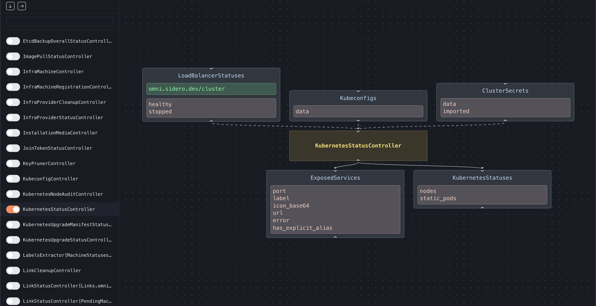

# Omni Inspector Tool

Shows the dynamic flow chart of all Omni resources and controllers.



## Running

Run Omni in debug mode.

For example:

```bash
make docker-compose-up WITH_DEBUG=true
```

Build the Omni inspector

```bash
make omni-inspector-linux-amd64
```

Run the inspector:

```bash
_out/omni-inspector-linux-amd64
```

The inspector will be accessable on `http://localhost:12000`.
